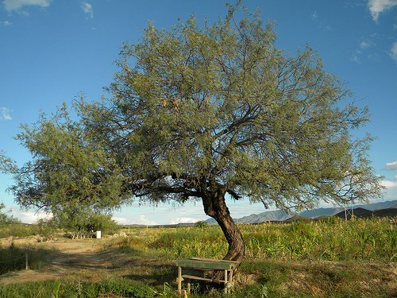

# Mezquitejs
Util to map objects going inside of a object.


# Install

```bash
$ npm instal mezquite --save
```
# Use

```js
let mezquite = new require('mezquite')()
let source = {
  'test2': {
    test3: {test4: 'test5'}
  }
};
// with the map object you can go inside of source
let map = {
  'test1': 'test2.test3.test4'
};
let mapped = mezquite.get(source, map);
assert.equal(mapped.test1, 'test5');

```

You can define in methods property a set of functions to be used in your maps.

```js
let source = {
  'test2': {
    test3: {test4: 'test5'}
  }
};
let map = {
  'test1': 'test2.$method.test3.test4'
};
let called;
mezquite.methods.method = function(mapped) {
  // every method receive the value mapped until now
  // mapped = {
  //  test3: {test4: 'test5'}
  // }
  // The value is not cloned
  assert(mapped.test3.test4 === 'test5');
  // you can modify it or return other value
  mapped.test3.test4 = 'test6'
  return mapped;

  // or
  //
  // return {
  //   test3: {
  //   test4: 'test6'
  //    }
  // }
};
let mapped = mezquite.get(source, map);
assert(mapped.test1 === 'test6');

```

# API Documentation

## Mezquite Class ( )

Not receive any params to be instanced

## Mezquite Instance Method

### mezquite.get(source,map)

Default value are { } for both. Should be objects instance where schema used like:
#### map:

```js
{
  key: mapString,
  [key2: mapString2]
}

```
where mapString = 'map1[.map2.map3]'
and key is used to build the object mapped.
#### source:
```js
{
  map: mappedValue
}
```
map in source and map's in map Object must coincide.
Get method try go inside recursively of mappedValue if mapString has more than one map.


## Mezquite Instance Properties

### mezquite.methods

Default value is {}, here all methods to be availables to be used like '$methodName' in map's of map Object should be stored.

#### schema

```js
{
  methodName: Function(mapped){}
}
```

every method is exec with the value mapped until now in the recursive call. 
